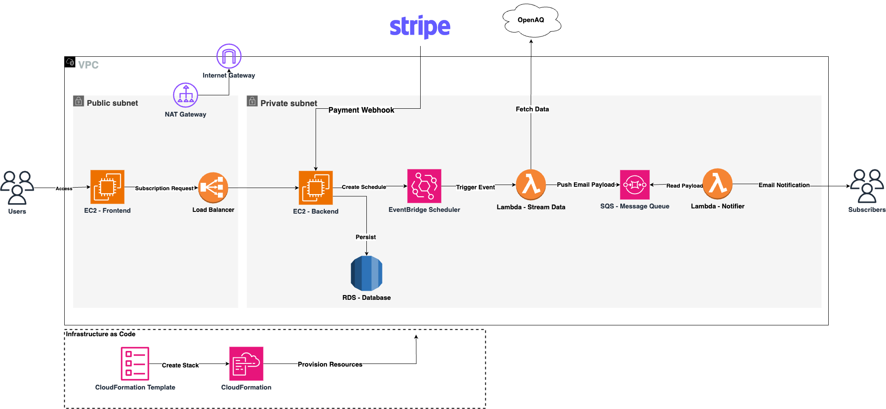

# Air Alerts

Get real time air-quality alerts in your inbox.

## Architecture

## AWS Cloud Services

* EC2
* AWS Lambda
* AWS EventBridge
* AWS SQS
* AWS VPC
* Load Balancer
* AWS RDS
* AWS CloudFormation

## Languages/Frameworks/Technologies

* Java 17
* Spring Boot
* JavaScript
* ReactJS
* Stripe Payment Gateway
* OpenAQ API
* JUnit
* TDD

## Key Features

* Subscribers get email alerts of air-quality (PM 2.5, PM 10 etc.) metrics based on their desired schedule.
* The platform accepts the subscription payment via Stripe Payment Gateway.
* Event driven asynchronous architecture to send alerts by using on-demand compute services.
* Message queue (AWS SQS) used to decouple email messaging service. 

